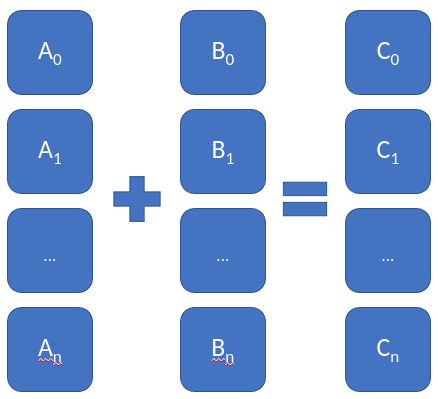

## What are SIMD instructions?

Have you ever heard of SIMD instructions? SIMD stands for single instruction on multiple data. This means that with __one CPU instruction can operate in parallel on more than one unit of data__.

### Figure: Vector addition



## What are AVX instructions?

AVX (or Advanced Vector Extensions) are SIMD instructions in the x86 ISA that are currently in most Intel and AMD proccesors. We have inside these processors the "multiple data" AVX registers of 128 bits, AVX2 registers of 256 bits or even (only Intel) AVX-512 registers of 512 bits. 

### Example: 32 8-bit floating point numbers parallel adding

```C++
#include <vector>
#include <random>
#include <iostream>
#include <immintrin.h>

int main(){
    /* Array initialization */
    float *arr1 = new float[8];
    float *arr2 = new float[8];

    std::random_device rd;
    std::default_random_engine e(rd());
    std::uniform_real_distribution<float> uniform_dist(0, 5);

    for (size_t i = 0; i < 8; ++i) {
        arr1[i] = uniform_dist(e);
        arr2[i] = uniform_dist(e);
    }

    std::cout << "arr1: ";
    for (size_t i = 0; i < 8; ++i) {
        std::cout << arr1[i] << " ";
    }
    std::cout << '\n';

    std::cout << "arr2: ";
    for (size_t i = 0; i < 8; ++i) {
        std::cout << arr2[i] << " ";
    }
    std::cout << '\n';

    /* AVX register load and adding */
    __m256 ymm0, ymm1;

    ymm0 = __builtin_ia32_loadups256(&arr1[0]);
    ymm1 = __builtin_ia32_loadups256(&arr2[0]);

    ymm0 = _mm256_add_ps(ymm0, ymm1);

    /* AVX register store */

    __builtin_ia32_storeups256(&arr1[0], ymm0);

    std::cout << "final arr1: ";
    for (size_t i = 0; i < 8; ++i) {
        std::cout << arr1[i] << " ";
    }
    std::cout << '\n';

    return 0;
}
```

Output:
```bash
arr1: 3.88367 2.68941 4.58094 1.88364 4.34451 1.29185 3.32449 1.6838 
arr2: 2.87605 0.854976 1.83774 3.31614 3.09462 2.13681 4.69725 4.55045 
final arr1: 6.75972 3.54438 6.41868 5.19978 7.43913 3.42866 8.02174 6.23425
```

## Application: Vector multiplication

As always in parallel programming, the typical example is to implement vector or matrix multiplication in some parallel way. In our case we are going to use AVX2 256 bit register for 8 floating point numbers of 32 bits. In every processor with AVX2 capabilities it has __16 256 bit registers__, namely YMM0 to YMM15 in the processor's developer manual.

In vector multiplication, we have $\sum_i a_i\cdot b_i$. So first we need to multiply the vector and then reduce it with additions. __Recommendation__: Use all AVX register to optimize the time.

```C++
#include <vector>
#include <random>
#include <iostream>
#include <immintrin.h>
#include <chrono>

int main(){
    
    auto len = 100000;
    
    /* Array initialization */
    float *arr1 = new float[len];
    float *arr2 = new float[len];
    
    std::random_device rd;
    std::default_random_engine e(rd());
    std::uniform_real_distribution<float> uniform_dist(0, 1);
    
    for (size_t i = 0; i < len; ++i) {
        arr1[i] = uniform_dist(e);
        arr2[i] = uniform_dist(e);
    }

    /* AVX register initialization and scratchpad*/
    auto scratchpad = new float[8];
    __m256 ymm0, ymm1, ymm2, ymm3, ymm4, ymm5, ymm6, ymm7,
      ymm8, ymm9, ymm10, ymm11, ymm12, ymm13, ymm14, ymm15;
      
    /* size calculations to use as much AVX registers as we can*/
    const auto size = len;
    const auto size_reduced = size - size % 64;
    const auto size_reduced_32 = size - size % 32;
      
    // Vector product
    // Get starting timepoint
    auto start = std::chrono::high_resolution_clock::now();
    float res = 0.0;
    for (auto j = 0; j < size_reduced; j += 64) {
        // Load 8 elements from arr1
        ymm0 = __builtin_ia32_loadups256(&arr1[j]);
        ymm1 = __builtin_ia32_loadups256(&arr1[j + 8]);
        ymm2 = __builtin_ia32_loadups256(&arr1[j + 16]);
        ymm3 = __builtin_ia32_loadups256(&arr1[j + 24]);
        ymm4 = __builtin_ia32_loadups256(&arr1[j + 32]);
        ymm5 = __builtin_ia32_loadups256(&arr1[j + 40]);
        ymm6 = __builtin_ia32_loadups256(&arr1[j + 48]);
        ymm7 = __builtin_ia32_loadups256(&arr1[j + 56]);
        
        // Load 8 elements from arr2
        ymm8 = __builtin_ia32_loadups256( &arr2[j]);
        ymm9 = __builtin_ia32_loadups256( &arr2[j + 8]);
        ymm10 = __builtin_ia32_loadups256(&arr2[j + 16]);
        ymm11 = __builtin_ia32_loadups256(&arr2[j + 24]);
        ymm12 = __builtin_ia32_loadups256(&arr2[j + 32]);
        ymm13 = __builtin_ia32_loadups256(&arr2[j + 40]);
        ymm14 = __builtin_ia32_loadups256(&arr2[j + 48]);
        ymm15 = __builtin_ia32_loadups256(&arr2[j + 56]);
        
        // Multiply element to element
        ymm0 = _mm256_mul_ps(ymm0, ymm8);
        ymm1 = _mm256_mul_ps(ymm1, ymm9);
        ymm2 = _mm256_mul_ps(ymm2, ymm10);
        ymm3 = _mm256_mul_ps(ymm3, ymm11);
        ymm4 = _mm256_mul_ps(ymm4, ymm12);
        ymm5 = _mm256_mul_ps(ymm5, ymm13);
        ymm6 = _mm256_mul_ps(ymm6, ymm14);
        ymm7 = _mm256_mul_ps(ymm7, ymm15);
        
        // Reduction to addition
        ymm0 = _mm256_add_ps(ymm0, ymm1);
        ymm2 = _mm256_add_ps(ymm2, ymm3);
        ymm4 = _mm256_add_ps(ymm4, ymm5);
        ymm6 = _mm256_add_ps(ymm6, ymm7);
        ymm0 = _mm256_add_ps(ymm0, ymm2);
        ymm4 = _mm256_add_ps(ymm4, ymm6);
        ymm0 = _mm256_add_ps(ymm0, ymm4);
        
        __builtin_ia32_storeups256(&scratchpad[0], ymm0);
        
        // Add reduction results
        for (int k = 0; k < 8; k++) {
            res += scratchpad[k];
            scratchpad[k] = 0;
        }
    }
    
    for (auto j = size_reduced; j < size_reduced_32; j += 32) {
        // Load 4 elements from arr1
        ymm0 = __builtin_ia32_loadups256(&arr1[j]);
        ymm1 = __builtin_ia32_loadups256(&arr1[j + 8]);
        ymm2 = __builtin_ia32_loadups256(&arr1[j + 16]);
        ymm3 = __builtin_ia32_loadups256(&arr1[j + 24]);
        
        // Load 8 elements from arr2
        ymm8 = __builtin_ia32_loadups256( &arr2[j]);
        ymm9 = __builtin_ia32_loadups256( &arr2[j + 8]);
        ymm10 = __builtin_ia32_loadups256(&arr2[j + 16]);
        ymm11 = __builtin_ia32_loadups256(&arr2[j + 24]);
        
        // Multiply element to element
        ymm0 = _mm256_mul_ps(ymm0, ymm8);
        ymm1 = _mm256_mul_ps(ymm1, ymm9);
        ymm2 = _mm256_mul_ps(ymm2, ymm10);
        ymm3 = _mm256_mul_ps(ymm3, ymm11);
        
        // Reduction to addition
        ymm0 = _mm256_add_ps(ymm0, ymm1);
        ymm2 = _mm256_add_ps(ymm2, ymm3);
        ymm0 = _mm256_add_ps(ymm0, ymm2);
        
        __builtin_ia32_storeups256(&scratchpad[0], ymm0);
        
        // Add reduction results
        for (int k = 0; k < 8; k++) {
            res += scratchpad[k];
            scratchpad[k] = 0;
        }

    }
    
    // Last elements in sequential
    for (auto l = size_reduced_32; l < size; l++) {
      res += arr1[l] * arr2[l];
    }
    // Get ending timepoint
    auto stop = std::chrono::high_resolution_clock::now();
    
    // Get duration. Substart timepoints to
    // get duration. To cast it to proper unit
    // use duration cast method
    auto duration = std::chrono::duration_cast<std::chrono::microseconds>(stop - start);
    std::cout << "Time taken by AVX accelerated app: "
         << duration.count() << " microseconds" << '\n';
    std::cout << "AVX accelerated result: " << res << "\n";
    
    // Get starting timepoint
    start = std::chrono::high_resolution_clock::now();
    res = 0.0;
    for(auto i=0; i<len; ++i){
        res += arr1[i]*arr2[i];
    }
    // Get ending timepoint
    stop = std::chrono::high_resolution_clock::now();
    
    // Get duration. Substart timepoints to
    // get duration. To cast it to proper unit
    // use duration cast method
    duration = std::chrono::duration_cast<std::chrono::microseconds>(stop - start);
    std::cout << "Time taken by sequential app: "
         << duration.count() << " microseconds" << '\n';
    std::cout << "sequential result: " << res << "\n";

    return 0;
}
```

Results:

```bash
Time taken by AVX accelerated app: 148 microseconds
AVX accelerated result: 25082.7
Time taken by sequential app: 332 microseconds
sequential result: 25082.6
```

## Other type of Intrinsics functions

AES cipher and decipher, Cryptographic quality seeds with the use of randomness in the processor electronics, SHA-1 and SHA-256 vectorial calculations helper.

## Where to found more?

[Intel Intrinsics Guide](https://www.intel.com/content/www/us/en/docs/intrinsics-guide/index.html)